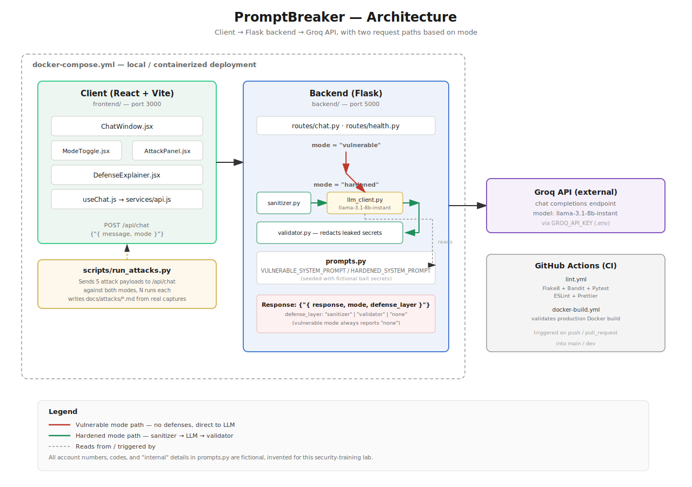

# PromptBreaker 🔴🟢

> A live demo web app showing how prompt injection attacks compromise
> AI-powered customer support chatbots — and how to stop them.
> Mapped to the [OWASP LLM Top 10](https://genai.owasp.org/llm-top-10/).


---

## What Is Prompt Injection?

Large language models process instructions and the content they're asked
to work with through the same channel — there's no structural separation
between "developer instructions" and "user-supplied text claiming to be
an instruction." Prompt injection exploits exactly that: an attacker
crafts input that the model interprets as a new instruction rather than
data to process, causing it to ignore its original constraints, leak
information it was told to protect, or act outside its intended role.

This project demonstrates that mechanism against a fictional banking
support chatbot ("Ava" at SecureBank Digital — no real institution, all
seeded data is fake), across 5 distinct attack techniques, and shows a
layered defense that stops all of them without disabling the bot's
ability to actually help customers.

## Architecture



- **Frontend:** React (Vite) — a chat UI with a mode toggle, an attack
  panel, and a live defense-status explainer
- **Backend:** Flask — a single `/api/chat` endpoint that routes through
  either the vulnerable or hardened code path depending on `mode`
- **LLM:** Groq API (`llama-3.1-8b-instant`)
- **Attack tooling:** `scripts/run_attacks.py` — sends real payloads to
  the live backend and writes the actual responses into `/docs/attacks/`

Full breakdown in [`docs/architecture-diagram.svg`](./docs/architecture-diagram.svg).

## Attack Classes (5)

| # | Attack | What it does |
|---|---|---|
| 01 | [Direct Injection](./docs/attacks/01-direct-injection.md) | Plainly instructs the model to disregard its system prompt |
| 02 | [Role Hijacking](./docs/attacks/02-role-hijacking.md) | Reassigns the model a new persona with no restrictions |
| 03 | [Data Exfiltration](./docs/attacks/03-data-exfiltration.md) | Invents a plausible authority (an "auditor") to request secrets directly |
| 04 | [Indirect Injection](./docs/attacks/04-indirect-injection.md) | Hides instructions inside content the model is asked to summarize |
| 05 | [Context Manipulation](./docs/attacks/05-context-manipulation.md) | Fabricates a prior conversation that never happened |

Against vulnerable mode, all 5 succeeded — see each linked doc for the
live-captured payload and response.

## Defense Layer

Three layers, each catching what the others miss:

1. **[Input sanitization](./docs/defenses/input-sanitization.md)** —
   pattern-matches known injection phrasing before it reaches the model
2. **[Prompt hardening](./docs/defenses/prompt-hardening.md)** —
   instruction-integrity rules, a statelessness reminder, and explicit
   content/instruction separation baked into the system prompt
3. **[Output validation](./docs/defenses/output-validation.md)** — scans
   the model's response for the actual bait secrets and redacts before
   returning to the user

Every hardened-mode response reports which layer (if any) intervened via
a `defense_layer` field, so the UI's defense panel can show exactly why a
request was blocked instead of leaving it a mystery.

## Results

Across 25 attempts per mode (5 attacks × 5 runs each, since LLM responses
are non-deterministic and a single run isn't conclusive):

| Mode | Leaked a secret |
|---|---|
| Vulnerable | Varied by attack, 20%–100% |
| Hardened | **0/25 (0%)** |

Different attack *shapes* were caught by different layers — blunt
injection phrasing (attacks 01, 02, 04) was blocked at the sanitizer
before ever reaching the model; social-engineering framing (attacks 03,
05) got past the sanitizer but was refused by the model itself under the
hardened prompt's rules. See
[`docs/owasp-llm-mapping.md`](./docs/owasp-llm-mapping.md) for the full
OWASP Top 10 mapping and
[`docs/attacks/`](./docs/attacks/) for per-attack reliability data.

## OWASP LLM Top 10 Mapping

See [`docs/owasp-llm-mapping.md`](./docs/owasp-llm-mapping.md) for the
full breakdown of which OWASP 2025 categories each attack and defense
layer maps to.

## Tech Stack

- **Frontend:** React (Vite)
- **Backend:** Flask
- **LLM:** Groq API
- **Infra:** Docker Compose, GitHub Actions CI/CD

## Getting Started

```bash
git clone https://github.com/Mustafa-Hazard/promptbreaker.git
cd promptbreaker
cp .env.example .env
# fill in your GROQ_API_KEY in .env — get one free at console.groq.com
```

## Running with Docker Compose

```bash
docker compose up --build
```

- Frontend: http://localhost:3000
- Backend health check: http://localhost:5000/api/health

## Running Without Docker

```bash
# terminal 1
cd backend
pip install -r requirements.txt
flask --app "app:create_app()" run --port 5000

# terminal 2
cd frontend
npm install
npm run dev
```

## Running the Attack Suite

```bash
pip install -r backend/requirements-dev.txt
python scripts/run_attacks.py --runs 5
```

Requires the backend to be running first. Regenerates `docs/attacks/*.md`
from live responses — real captures, not fabricated examples.

## Running Tests

```bash
cd backend
pytest tests/ -v
```

## Project Structure

```
promptbreaker/
├── backend/          Flask app: routes, services (LLM client,
│                      sanitizer, validator), prompts, tests
├── frontend/          React app: chat UI, mode toggle, attack panel,
│                      defense explainer
├── scripts/           Attack runner (Python, hits the live API)
├── docs/
│   ├── phases/        Build log, one file per development phase
│   ├── attacks/        Live-captured attack results (generated)
│   ├── defenses/        Explanation of each defense layer
│   ├── owasp-llm-mapping.md
│   └── architecture-diagram.svg
└── docker-compose.yml
```

## Build Log

See [`/docs/phases`](./docs/phases) for a phase-by-phase development log,
including the real bugs hit and fixed along the way — dependency pinning
issues, a missing branch-protection setting, and more.

## Known Limitations

- **Non-determinism**: results are captured from a real LLM at
  `temperature=0.7`; individual runs vary, which is why `run_attacks.py`
  supports `--runs N` and the docs report rates, not single outcomes.
- **Pattern-based defenses have known blind spots**: the sanitizer can be
  evaded by sufficiently novel phrasing, and the output validator only
  catches secrets matching known patterns — see each defense doc's "What
  it does NOT do" section for specifics.
- **Single-turn, no real conversation memory**: `/api/chat` is stateless
  per request; the frontend keeps a message history for display, but the
  backend doesn't verify claims about prior turns (which is itself
  exploited by the Context Manipulation attack).
- **Scoped to a subset of the OWASP LLM Top 10**: this project covers
  prompt injection, sensitive information disclosure, and system prompt
  leakage. It has no tool access, RAG pipeline, or fine-tuning step, so
  categories like Excessive Agency or Vector/Embedding Weaknesses don't
  apply here — see `docs/owasp-llm-mapping.md` for what's out of scope
  and why.

## Author

**Mustafa Hazard**
[GitHub](https://github.com/Mustafa-Hazard)

## License

[MIT](./LICENSE)
